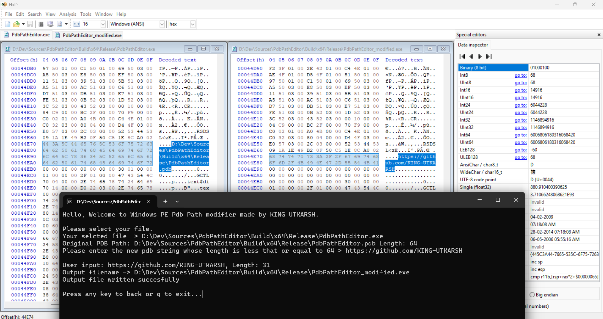

# PdbPathEditor
PdbPathEditor is a simple application which can add custom string in the place of PDB(Program Database) path embedded in a windows PE file.

# Showcase

# Limitation
- Currenlty it can only add a string whose length is equals to or less than the original pdb path string.